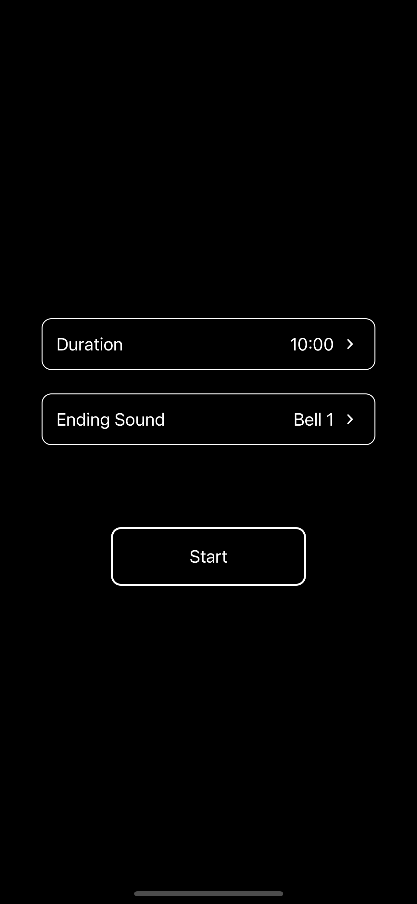

<div align="center">
  <h1>Minimal Meditation</h1>
  <a align="center" href="https://play.google.com/store/apps/details?id=com.trybicki.minimalmeditation"></a>
  <a align="center" href="https://apps.apple.com/us/app/minimal-meditation/id1619968801"></a>

<h3>Meditation app</h3>
</div>

## Screenshots

<p align="center">
  
  
</p>

## Technologies

- React Native
- Expo
- TypeScript
- React Native Elements

## Local Development

To run locally:

```terminal
yarn
yarn start
```
